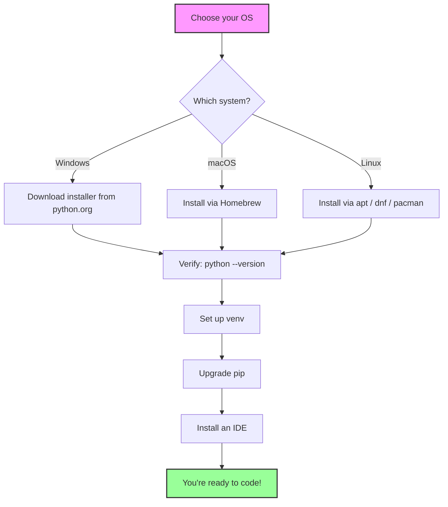
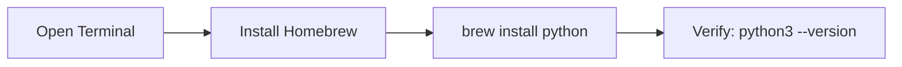
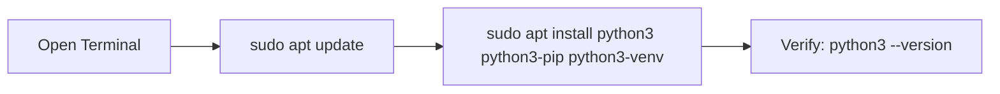
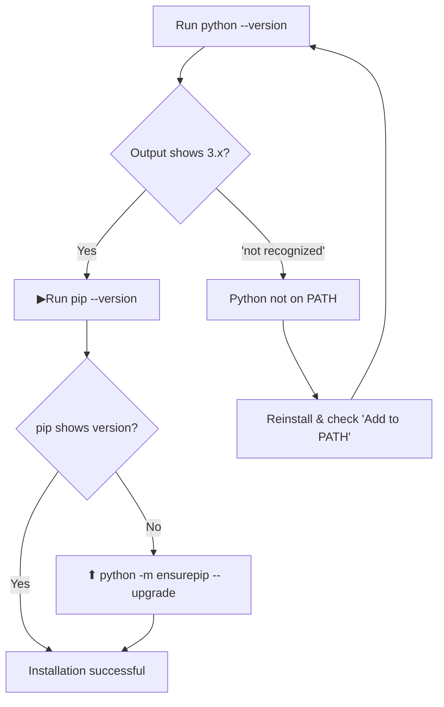

# Complete Python Setup Guide

> **Windows · macOS · Linux** — step-by-step instructions to get a full, production-ready Python environment on your machine.

---

## Table of Contents

1. [Before You Start](#1-before-you-start)
2. [Windows Installation](#2-windows-installation)
3. [macOS Installation](#3-macos-installation)
4. [Linux Installation](#4-linux-installation)
5. [Verify Your Installation](#5-verify-your-installation)
6. [Set Up a Virtual Environment](#6-set-up-a-virtual-environment)
7. [Install a Package Manager (pip / uv)](#7-install-a-package-manager-pip--uv)
8. [Install an IDE / Editor](#8-install-an-ide--editor)
9. [Project Workflow Cheat Sheet](#9-project-workflow-cheat-sheet)
10. [Troubleshooting](#10-troubleshooting)

---

## Overview



---

## 1. Before You Start

### What you need
- A stable internet connection
- Admin / sudo rights on your machine
- ~500 MB of free disk space

### Key terminology
| Term | Meaning |
|------|---------|
| **Python** | The programming language interpreter |
| **pip** | Python's default package installer |
| **venv** | Virtual environment to isolate project dependencies |
| **IDLE** | Simple editor bundled with Python |

### Quick tips
- **Python 2 is dead** — always install **Python 3.12+**.
- Don't install from the **Microsoft Store** if you want full control — use `python.org` or `pyenv`.
- Never type `sudo pip install` on Linux/macOS — always use a virtual environment.

---

## 2. Windows Installation

### Step 2.1 — Download the installer


1. Open your browser and go to **https://www.python.org/downloads**
2. Click the big yellow **Download Python** button (latest 3.x version).
3. Run the downloaded `.exe` file.

### Step 2.2 — CRITICAL: installer options

> **The most common mistake!** Make sure you tick the box at the bottom:

```
[✔] Add python.exe to PATH        ← MUST CHECK THIS
[✔] Install launcher for all users (recommended)
```

Then click **Install Now**.

### Step 2.3 — Verify the install

Open **PowerShell** or **Command Prompt** and type:

```powershell
python --version
```

Expected output:
```
Python 3.12.x
```

If that fails, try:

```powershell
py --version
```

### Step 2.4 — Alternative: Install via winget (fastest)

Open **PowerShell** and run:

```powershell
winget install Python.Python.3.12
```

Or, install via **Microsoft Store**:

```powershell
winget install "Python 3.12"
```

---

## 3. macOS Installation

### Step 3.1 — Install Homebrew (if not present)



Open **Terminal** (press `Cmd + Space`, type *Terminal*):

```bash
/bin/bash -c "$(curl -fsSL https://raw.githubusercontent.com/Homebrew/install/HEAD/install.sh)"
```

Follow the on-screen prompts and enter your password when asked.

### Step 3.2 — Install Python via Homebrew

```bash
brew install python
```

> This installs the latest Python 3.x and pip automatically.

### Step 3.3 — Alternative: Download installer from python.org

1. Go to **https://www.python.org/downloads**
2. Download the **macOS 64-bit universal2 installer**.
3. Double-click the `.pkg` and follow the wizard.
4. Accept the license, choose install location, and click **Install**.

### Step 3.4 — Use pyenv (recommended for multiple versions)

```bash
brew install pyenv
echo 'export PATH="$HOME/.pyenv/bin:$PATH"' >> ~/.zshrc
echo 'eval "$(pyenv init -)"' >> ~/.zshrc
source ~/.zshrc
```

Install any version:

```bash
pyenv install 3.12
pyenv global 3.12
```

---

## 4. Linux Installation

Choose your distro below.

### 4.1 — Debian / Ubuntu (apt)



```bash
sudo apt update
sudo apt install -y python3 python3-pip python3-venv
```

### 4.2 — Fedora / RHEL (dnf)

```bash
sudo dnf update
sudo dnf install -y python3 python3-pip
```

### 4.3 — Arch / Manjaro (pacman)

```bash
sudo pacman -Syu
sudo pacman -S python python-pip
```

### 4.4 — Install the latest version with pyenv (any distro)

> Distro repos often lag behind. Use **pyenv** for the newest Python:

```bash
sudo apt install -y build-essential libssl-dev zlib1g-dev \
  libbz2-dev libreadline-dev libsqlite3-dev curl git libncursesw5-dev \
  xz-utils tk-dev libxml2-dev libxmlsec1-dev libffi-dev liblzma-dev
```

```bash
curl https://pyenv.run | bash
```

Then add to your `~/.bashrc`:

```bash
echo 'export PATH="$HOME/.pyenv/bin:$PATH"' >> ~/.bashrc
echo 'eval "$(pyenv init -)"' >> ~/.bashrc
source ~/.bashrc
```

Install Python:

```bash
pyenv install 3.12
pyenv global 3.12
```

---

## 5. Verify Your Installation

Run these commands in your terminal:

```bash
python --version     # or python3 --version
pip --version        # or pip3 --version
```



---

## 6. Set Up a Virtual Environment

A **virtual environment** keeps each project's packages isolated — this is a best practice you should always follow.

### Create a venv

```bash
# Windows (PowerShell / CMD)
python -m venv .venv

# macOS / Linux
python3 -m venv .venv
```

### Activate it

```mermaid
flowchart TD
    A[ Create .venv] --> B{Which OS?}
    B -->|Windows PowerShell| C[.venv\Scripts\Activate.ps1]
    B -->|Windows CMD| D[.venv\Scripts\activate.bat]
    B -->|macOS / Linux| E[source .venv/bin/activate]
    C --> F[👀 See '(.venv)' in prompt]
    D --> F
    E --> F
```

```powershell
# Windows — PowerShell
.venv\Scripts\Activate.ps1

# Windows — CMD
.venv\Scripts\activate.bat
```

```bash
# macOS / Linux
source .venv/bin/activate
```

You'll know it worked when your prompt shows **`(.venv)`** at the beginning.

### Exit the venv

```bash
deactivate
```

---

## 7. Install a Package Manager (pip / uv)

### Upgrade pip to the latest

```bash
python -m pip install --upgrade pip
```

###  Optional: Install `uv` (super-fast modern package manager)

`uv` is the blazing-fast replacement for pip + venv.

```bash
# Windows (PowerShell)
powershell -ExecutionPolicy ByPass -c "irm https://astral.sh/uv/install.ps1 | iex"

# macOS / Linux
curl -LsSf https://astral.sh/uv/install.sh | sh
```

Then use it like this:

```bash
uv venv .venv          # create venv
uv pip install requests  # install a package
uv add pandas          # add to pyproject.toml
```

### Install your first packages

```bash
pip install requests numpy pandas
```

### Uninstall

```bash
pip uninstall requests
```

### List installed packages

```bash
pip list
```

---

## 8. Install an IDE / Editor

| Editor | Best for | Install |
|--------|----------|---------|
| **VS Code**  | Everyone — best all-rounder | [code.visualstudio.com](https://code.visualstudio.com) |
| **PyCharm**  | Serious Python projects | [jetbrains.com/pycharm](https://www.jetbrains.com/pycharm) |
| **Sublime Text**  | Lightweight & fast | [sublimetext.com](https://www.sublimetext.com) |
| **Jupyter Notebook**  | Data science / research | `pip install jupyter` |

### VS Code quick setup (recommended)

1. Install **VS Code** from the link above.
2. Open the **Extensions** panel (`Ctrl+Shift+X` / `Cmd+Shift+X`).
3. Install the **Python** extension by Microsoft.
4. Press `Ctrl+Shift+P` → type **Python: Select Interpreter**.
5. Choose your `.venv` interpreter.

```bash
# Install Jupyter (optional)
pip install jupyter
jupyter notebook
```

---

## 9. Project Workflow Cheat Sheet


```bash
# 1. Create a project folder
mkdir my-project
cd my-project

# 2. Create & activate the venv
python -m venv .venv
# Windows:      .venv\Scripts\Activate.ps1
# macOS/Linux:  source .venv/bin/activate

# 3. Install dependencies
pip install --upgrade pip
pip install requests

# 4. Save dependencies for sharing
pip freeze > requirements.txt

# 5. Someone else can install them later:
pip install -r requirements.txt
```

---

## 10. Troubleshooting

###  `'python' is not recognized as an internal or external command` (Windows)

- The installer's **"Add to PATH"** box wasn't checked.
- **Fix:** Reinstall and tick the box, **or** manually add `C:\Users\<you>\AppData\Local\Programs\Python\Python312\` to your PATH.

###  `python` works but `pip` doesn't

```bash
python -m pip install --upgrade pip
```

Always use `python -m pip` to guarantee you're using the right pip.

###  Permission errors on Linux/macOS (`E: Unable to locate package`)

```bash
sudo apt update
```

###  `ImportError: No module named X`

Your package is installed in a **different** environment. Activate your venv first:

```bash
source .venv/bin/activate   # or .venv\Scripts\Activate.ps1
pip install X
```

###  macOS says *"python: command not found"* but `python3` works

That's normal — macOS only ships `python3`. Use `python3` or create an alias:

```bash
echo "alias python=python3" >> ~/.zshrc
source ~/.zshrc
```

###  `brew: command not found`

Reinstall Homebrew — it's likely not on your PATH:

```bash
echo 'eval "$(/opt/homebrew/bin/brew shellenv)"' >> ~/.zprofile
source ~/.zprofile
```

---

##  Final Checklist

- [ ] `python --version` → shows **3.12+**
- [ ] `pip --version` → shows a version
- [ ] Virtual environment created & activated
- [ ] IDE installed with Python interpreter selected
- [ ] Successfully installed at least one package
- [ ] You've written your first line of code! 🎊

```python
print("Hello, World! ")
```

---

##  Useful Links

| Resource | URL |
|----------|-----|
| Official downloads | [python.org/downloads](https://www.python.org/downloads) |
| Official docs | [docs.python.org](https://docs.python.org) |
| pip docs | [pip.pypa.io](https://pip.pypa.io) |
| pyenv | [github.com/pyenv/pyenv](https://github.com/pyenv/pyenv) |
| uv | [astral.sh/uv](https://astral.sh/uv) |
| Real Python tutorial | [realpython.com](https://realpython.com) |
